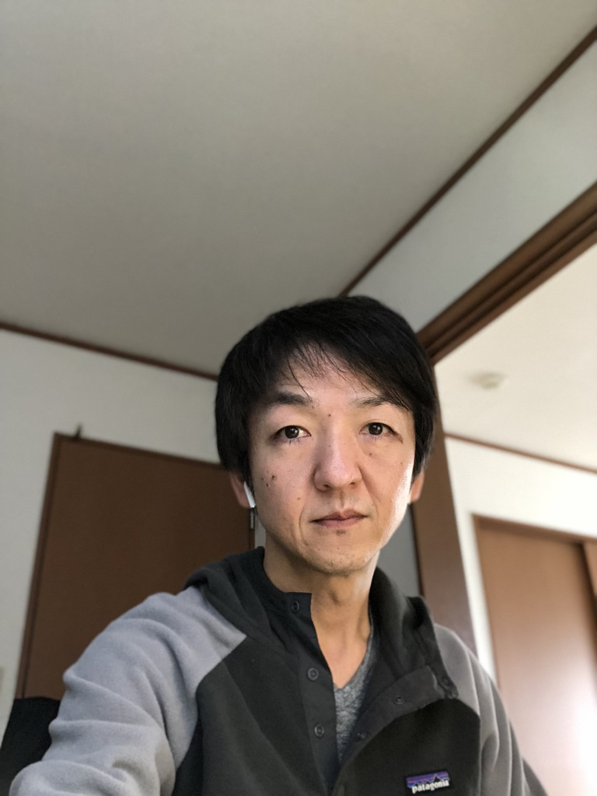

# 履歴書

**2025年9月26日現在**

---

## 【基本情報】

| 項目 | 内容 |
|------|------|
| **氏名** | 奧村 宗久（おくむら むねひさ） |
| **生年月日** | 1974年2月24日生（満51歳） |
| **性別** | 男性 |
| **現住所** | 〒167-0051 東京都杉並区荻窪3-13-2 シャロム雅　103号 |
| **連絡先** | 携帯：090-3988-7582 Email：okumuram.gm@gmail.com |
| **最寄駅** | 丸の内線 荻窪駅 |
| **通勤時間** | 約1時間 |
| **扶養家族** | 0名（配偶者なし） |

---

## 【学歴】

| 年月 | 学歴 |
|------|------|
| 1992年3月 | 和歌山県立桐蔭高等学校 卒業 |
| 1992年4月 | 明治大学 理工学部 電子通信工学科 入学 |
| 1996年3月 | 明治大学 理工学部 電子通信工学科 卒業 |

---

## 【職歴】

| 年月 | 職歴 |
|------|------|
| 1996年4月 | 株式会社ジャストシステム 入社 |
| 2012年6月 | 株式会社ジャストシステム 退社 |
| 2012年6月 | 株式会社コマース21 入社 |
| 2016年11月 | 株式会社コマース21 退社 |
| 2016年11月 | バリューコマース株式会社 入社 |
| 2023年9月 | バリューコマース株式会社 退社 |
| 2023年10月 | FID株式会社 入社 |
| 2023年12月 | FID株式会社 退社 |
| 2023年12月～2025年9月 | 家族介護のため休職期間 |
| 2025年10月 | 株式会社キャル 入社 |

---

## 【保有資格】

| 取得年月 | 資格名 |
|---------|--------|
| 2014年4月 | ITストラテジスト |
| 2016年3月 | プロジェクトマネージャ |
| 2018年10月 | XMLマスター |

---

## 【志望動機】

これまで20年以上にわたり、ソフトウェア開発とプロジェクトマネジメントに携わってきました。

**キャリアの転換点**は大きく3つあります。

### 1. 開発者としての基礎固め（ジャストシステム時代）
大学卒業後、16年間プログラマーとしてC++を使ったデスクトップアプリケーション開発に従事。一太郎や花子といった大規模ソフトウェアの開発を通じて、品質へのこだわりと技術の基礎を学びました。

### 2. ECビジネスへの挑戦（コマース21時代）
プロジェクトマネージャーとして、主にアパレル企業のECサイト構築を担当。**お客様との距離感を掴み、顧客の真意を読み取る力**を磨きました。提案営業的な要素も強く、技術とビジネスの橋渡し役として成長できた時期です。

### 3. SaaSプロダクトの立ち上げ（バリューコマース時代）
Yahoo!ショッピング向けのSaaSプロダクトを0から立ち上げ。巨大プラットフォームで**いかに離脱率を下げ、購買につなげるか**という視点で企画・開発を推進。ユーザー体験とビジネス成果の両立を追求しました。

### 休職期間について
2023年末から約2年間、父親の介護のため実家に戻り休職していました。無事に入院の目処が立ったため、このタイミングで転職活動を再開することを決めました。

---

## 【今後の展望】

### 若手育成への強い関心

51歳という年齢を迎え、**自分自身の成長ややりがいよりも、若手の育成に強い興味**を持っています。

かつては「背中を見て学べ」というスタイルで部下を指導していましたが、今の時代にはもっと**相手に寄り添い、時には優しく、時には厳しく接する**アプローチが必要だと考えています。メンバーの成長を促し、チーム全体の力を底上げすることに貢献したいです。

### 技術とマネジメントの両輪

10年以上、上流工程やプロジェクトマネジメントを担ってきましたが、**新人時代に培ったコーディングスキルについても、まだまだ学ぶべきことがある**と感じています。

技術トレンドは日々進化しており、AIやクラウドネイティブな開発など、新しい領域にも積極的に取り組んでいきたいと考えています。マネジメントだけでなく、必要に応じて手を動かせる「**プレイングマネージャー**」としての役割を果たせることも強みです。

### チームで成果を出すことへのこだわり

色々なメンバーと**切磋琢磨しながら業務に真摯に取り組む**ことを大切にしています。個人のスキルアップだけでなく、チーム全体で成果を出し、ビジネスに貢献することにやりがいを感じます。

---

## 【特記事項】

- **働き方**: フルタイム勤務、リモートワーク・出社どちらも対応可能
- **希望勤務地**: 東京都内および近郊
- **転職回数**: 4回（ジャストシステム16年、コマース21 4.5年、バリューコマース7年、FID 3ヶ月）
- **休職理由**: 家族介護のため（2023年12月～2025年9月）
- **健康状態**: 良好

---

## 【一言】

これまでの経験を活かし、プロダクト開発やチームマネジメントにおいて即戦力として貢献できると確信しています。

特に、**0→1のプロダクト立ち上げ経験**や**ECサイト・SaaS事業のドメイン知識**、**顧客折衝力**は、貴社のビジネス成長に直結する形でお役に立てると考えています。

また、若手の育成やチームビルディングにも情熱を持って取り組み、組織全体の成長に貢献したいと思います。

何卒よろしくお願いいたします。

---

**以上**
