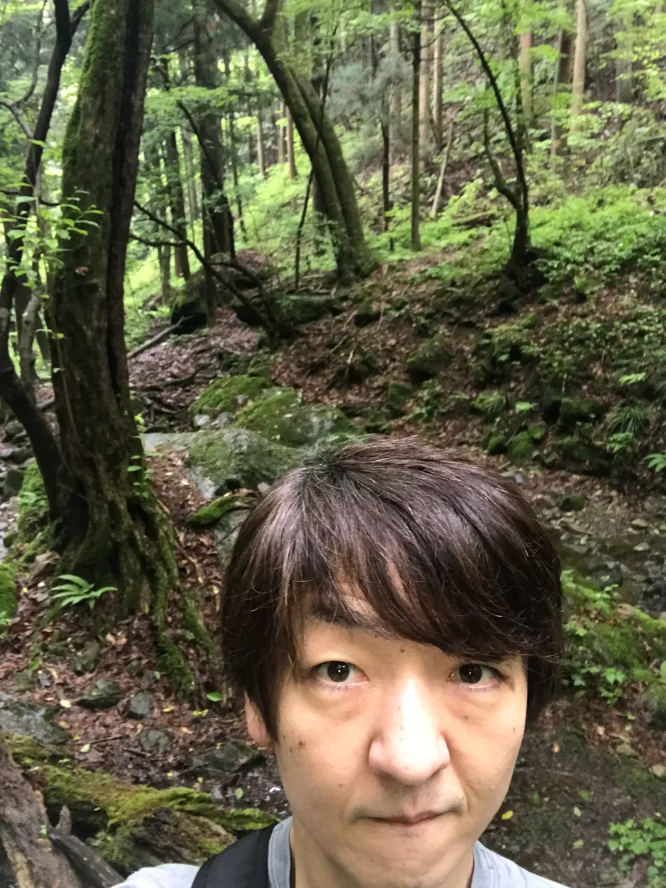

# 履歴書

**2025年9月26日現在**

---

## 【基本情報】

| 項目 | 内容 |
|------|------|
| **氏名** | 奧村 宗久（おくむら むねひさ） |
| **生年月日** | 1974年2月24日生（満51歳） |
| **性別** | 男性 |
| **連絡先** | Email：okumuram.gm@gmail.com |
| **最寄駅** | 丸の内線 荻窪駅 |

---

## 【学歴】

| 年月 | 学歴 |
|------|------|
| 1992年3月 | 和歌山県立桐蔭高等学校 卒業 |
| 1992年4月 | 明治大学 理工学部 電子通信工学科 入学 |
| 1996年3月 | 明治大学 理工学部 電子通信工学科 卒業 |

---

## 【職歴】

| 年月 | 職歴 |
|------|------|
| 1996年4月 | 株式会社ジャストシステム 入社 |
| 2012年6月 | 株式会社ジャストシステム 退社 |
| 2012年6月 | 株式会社コマース21 入社 |
| 2016年11月 | 株式会社コマース21 退社 |
| 2016年11月 | バリューコマース株式会社 入社 |
| 2023年9月 | バリューコマース株式会社 退社 |
| 2023年10月 | FID株式会社 入社 |
| 2023年12月 | FID株式会社 退社 |
| 2023年12月～2025年9月 | 家族介護のため休職期間 |
| 2025年10月 | キャル株式会社 入社 |

**賞罰**：なし

---

## 【保有資格】

| 取得年月 | 資格名 |
|---------|--------|
| 2014年4月 | ITストラテジスト |
| 2016年3月 | プロジェクトマネージャ |
| 2018年10月 | XMLマスター |

---

## 👋 こんにちは！

51歳、現役エンジニア兼プロダクトマネージャーです。

- 🚀 Yahoo!向けSaaSを0から立ち上げ、10万ユーザー獲得
- 💪 最大10名のチームマネジメント経験
- 🎯 ECサイト・SaaS開発で20年以上の実績
- 🏃 週末は登山とコーディングを楽しむアクティブ派

---

## 📊 数字で見る実績

| 項目 | 実績 |
|------|------|
| **キャリア** | 20年以上 |
| **プロダクト立ち上げ** | Yahoo!向けSaaS（10万ユーザー） |
| **プロジェクト規模** | 最大1.5億円 |
| **マネジメント経験** | 最大10名 |
| **稼働率** | 99.5%以上を維持 |

---

## 🛠️ スキルセット

### 言語・フレームワーク

■■■■■■■■□□ Java / Spring（10年以上）

■■■■■■□□□□ TypeScript / React（学習中）

■■■■■□□□□□ C++

### マネジメント

■■■■■■■■■□ プロジェクトマネジメント

■■■■■■■■□□ プロダクトマネジメント

■■■■■■■□□□ チームビルディング

---

## 💼 主なプロジェクト

### 🎯 Yahoo!にぎわいサービス（2016-2023）

**Challenge**  
Yahoo!ショッピング出店者の集客支援SaaSを0から立ち上げ

**Solution**  
- 6ヶ月でMVPリリース
- 4名のチームをリード
- マルチテナント設計で安定稼働

**Result**  
✅ 10万ユーザー獲得  
✅ Yahoo!出店者の30%が利用  
✅ 稼働率99.5%以上を維持

---

## 【今までやってきたこと】

20年以上、ソフトウェア開発とプロジェクトマネジメントの世界で働いてきました。

キャリアを振り返ると、**3つの大きな転換点**があります。

### 1. 開発者としての基礎固め（ジャストシステム時代）
大学を卒業してから16年間、C++でデスクトップアプリケーション開発に携わりました。一太郎や花子といった、多くの人に使われる大規模ソフトウェアの開発を通じて、**品質へのこだわり**と**技術の基礎**をしっかり学べた時期です。

### 2. ECビジネスへの挑戦（コマース21時代）
プロジェクトマネージャーとして、アパレル企業のECサイト構築を数多く手がけました。ここで学んだのは、**お客様との距離感を掴むこと**。表面的な要望だけでなく、その裏にある本当のニーズを読み取る力が身についた時期でした。技術とビジネスの橋渡し役として、やりがいを感じていました。

### 3. SaaSプロダクトの立ち上げ（バリューコマース時代）
Yahoo!ショッピング向けのSaaSプロダクトを0から立ち上げ。巨大プラットフォームで、**どうやったらユーザーが離脱せずに購入まで進んでくれるか**。そんな視点で企画・開発を進めました。ユーザー体験とビジネス成果、両方を追いかける面白さを実感できました。

### 休職期間について
2023年末から約2年間、父の介護のために実家に戻っていました。

---

## 【今後やっていきたいこと】

### 若手育成に力を入れたい

51歳になって思うのは、**自分が成長するよりも、若手が成長する姿を見る方が嬉しい**ということ。

昔は「背中を見て学べ」みたいな指導をしていましたが（笑）、今の時代はもっと**相手に寄り添って、その人に合った育て方**をする必要があると感じています。優しく見守ることも、時には厳しく伝えることも。そうやってメンバーが成長し、チーム全体が強くなっていくのが理想です。

### 技術もマネジメントも、両方やっていきたい

10年以上、要件定義や設計といった上流工程を担当してきましたが、**コーディングも好き**なんです。新人時代に身につけたスキルも、まだまだブラッシュアップできると思っています。

最近の技術トレンド、特にAIを活用した開発やクラウドネイティブな設計にも興味津々。新しいことを学ぶのは楽しいですし、必要なときは自分でコードも書ける「プレイングマネージャー」として活躍できればと考えています。

### チーム全体で成果を出したい

結局のところ、**一人で頑張るより、みんなで成果を出す方が楽しい**んですよね。

色々なメンバーと切磋琢磨しながら、チーム全体のパフォーマンスを上げていく。個人のスキルアップも大事ですが、それがチームやビジネスの成果につながってこそ意味がある。そんな風に思っています。

---

## 🎨 オフの顔

  

  

  

週末は多摩の低山を登ったり、マラソンに挑戦したり。

体を動かすことで、仕事のパフォーマンスも上がってます。

最近はCursorやGeminiを使ったAI駆使型の開発にハマってて、

TypeScriptを猛勉強中です！

---

## 💻 GitHub活動

週末コーディングで作ったもの：

🌦️ [天気アプリ](https://github.com/m-okumura/weather-app.git)  
→ TypeScript + React で作成

📁 [ポートフォリオ](https://github.com/m-okumura/my-portfolio.git)  
→ このサイトのソースコード

📚 [React学習用](https://github.com/m-okumura/reactstudy.git)  
→ 学習の記録

---

## 【特記事項】

- **働き方**: フルタイム勤務、リモートワーク・出社どちらも対応可能
- **希望勤務地**: 東京都内および近郊
- **転職回数**: 4回（ジャストシステム16年、コマース21 4.5年、バリューコマース7年、FID 3ヶ月）
- **休職理由**: 家族介護のため（2023年12月～2025年9月）
- **健康状態**: 良好

---

## 【最後に】

これまでの経験を活かして、プロダクト開発やチームマネジメントで即戦力として貢献できると思っています。

特に、**0→1でプロダクトを立ち上げた経験**や**ECサイト・SaaS事業のノウハウ**、**お客様との折衝力**は、ビジネスの成長に直結する形でお役に立てるはず。

それと、若手の育成やチームビルディングにも情熱を持って取り組んで、組織全体を盛り上げていきたいです。

よろしくお願いします！

---

**以上**
